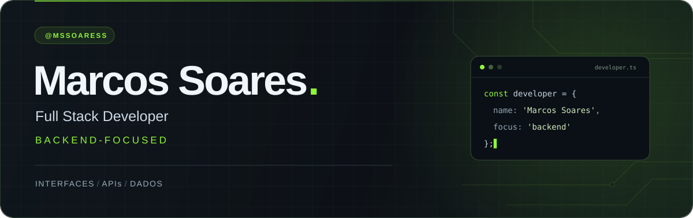

  

&nbsp;

&nbsp;

  

<samp>Da interface à API. Da lógica aos dados.</samp>

 

## 01 / Sobre mim

Desenvolvedor **Full Stack com foco em Backend** e estudante de **Ciência da Computação na UniNassau**. Desenvolvo aplicações web em produção para clientes reais, conectando interfaces, regras de negócio e dados.

Meu foco está em **APIs REST**, **sistemas em tempo real** e na organização do código para facilitar sua manutenção. Trabalho com **Node.js, React e Firebase**, do desenvolvimento ao deploy.

 

## 02 / Tech stack

<h3>Linguagens</h3>

Java &nbsp; · &nbsp; JavaScript &nbsp; · &nbsp; TypeScript &nbsp; · &nbsp; Python

<h3>Frontend</h3>

React &nbsp; · &nbsp; Vite &nbsp; · &nbsp; HTML5 &nbsp; · &nbsp; CSS3

<h3>Backend &amp; banco de dados</h3>

Node.js &nbsp; · &nbsp; Firebase &nbsp; · &nbsp; MySQL &nbsp; · &nbsp; PostgreSQL

<h3>Ferramentas &amp; deploy</h3>

Git &nbsp; · &nbsp; GitHub &nbsp; · &nbsp; Vercel &nbsp; · &nbsp; VS Code &nbsp; · &nbsp; Figma

 

## 03 / Estatísticas

 

  

Um pouco da minha jornada em código.

 

## 04 / Cada contribuição conta

<picture>
  <source media="(prefers-color-scheme: dark)" srcset="https://raw.githubusercontent.com/mssoaress/mssoaress/output/github-contribution-grid-snake-dark.svg" />
  <source media="(prefers-color-scheme: light)" srcset="https://raw.githubusercontent.com/mssoaress/mssoaress/output/github-contribution-grid-snake.svg" />
  
</picture>

 

---

<h3>Vamos conversar?</h3>

Desenvolvimento, tecnologia e boas ideias.

  

<samp>Marcos Soares · @mssoaress</samp>

